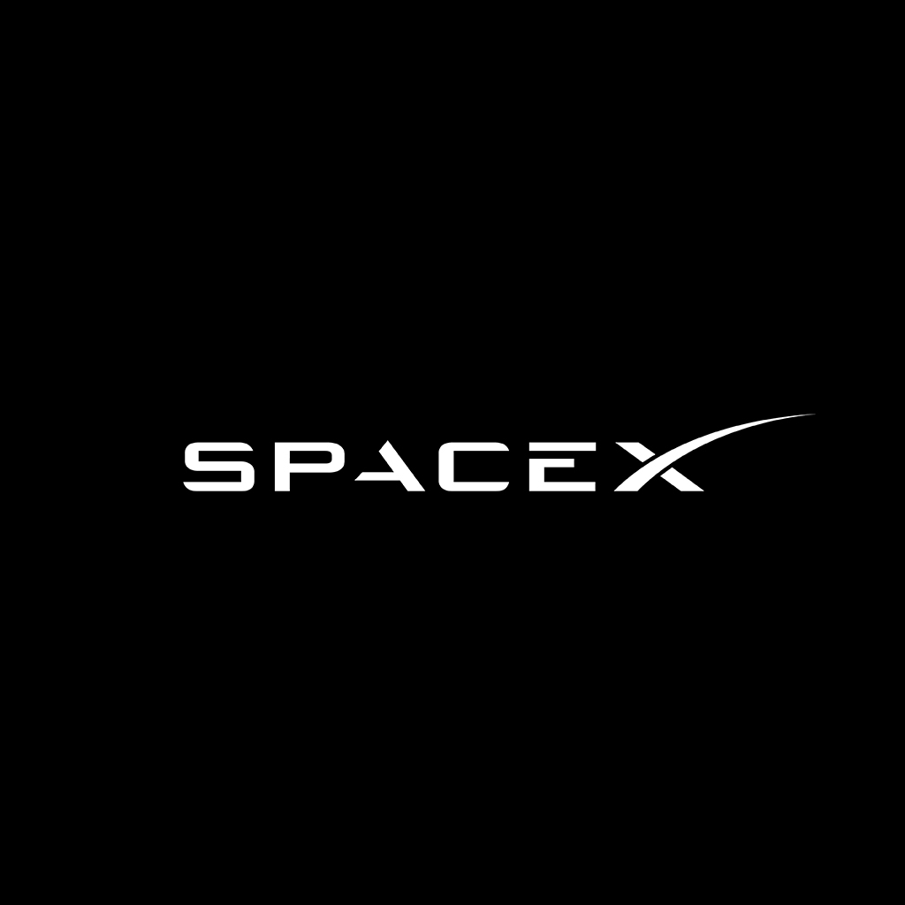

# SpaceX Falcon 9 First Stage Landing Pediction

# Overview
In this project, I aim to predict whether the first stage of the SpaceX Falcon 9 rocket will land successfully. SpaceX has revolutionized the space industry by developing reusable rockets, significantly reducing the cost of space exploration. The ability to accurately predict the landing outcome of the Falcon 9 first stage is crucial for estimating the cost of a launch and competing against SpaceX in rocket launch bids.

The main goal of this project is to build a predictive model that can determine the likelihood of a successful landing based on various factors and features associated with the rocket launch. By analyzing historical data and training my model on past launch outcomes, I aim to provide valuable insights and predictions for future missions.

# Data Collection
To perform this analysis, I collected the necessary data from an API. The data includes information about previous Falcon 9 launches, such as launch parameters, mission details, weather conditions, and the landing outcome. The data was retrieved using Python and stored in a structured format for further analysis.

# Data Preprocessing
Before training my predictive model, I performed several data preprocessing steps to ensure the data's quality and suitability for analysis. This included handling missing values, handling categorical variables, feature scaling, and splitting the data into training and testing sets.

# Exploratory Data Analysis (EDA)
To gain a better understanding of the data and uncover patterns or relationships, I conducted exploratory data analysis. Through visualizations and statistical analysis, I explored the distribution of variables, examined correlations, and identified any significant factors that could impact the landing outcome.

# Model Development
I trained several machine learning models on the preprocessed data to predict the landing outcome of the Falcon 9 first stage. The models considered include decision trees, random forests, support vector machines, and logistic regression. I used appropriate evaluation metrics to assess the performance of each model and selected the best-performing model for final predictions.

# Model Evaluation
To evaluate the performance of my predictive model, I employed various evaluation metrics, such as accuracy, precision, recall, and F1 score. Additionally, I conducted cross-validation and analyzed the model's performance on the testing set to ensure its generalizability and robustness.

# Results and Conclusion
Based on my analysis and predictions, I can provide insights into the likelihood of a successful landing for future Falcon 9 rocket launches. By utilizing the developed predictive model, alternate companies or organizations can estimate the cost of their launches and compete against SpaceX in rocket launch bids more effectively.

# Future Improvements
This project provides a foundation for further enhancements and improvements. Some potential areas for future work include:

  -Incorporating additional features and data sources to improve the prediction accuracy.
  -Exploring advanced machine learning algorithms or ensemble techniques.
  -Conducting a thorough analysis of feature importance and understanding the factors that significantly influence the landing outcome.
  -Deploying the predictive model as an interactive web application or API to provide real-time predictions.
